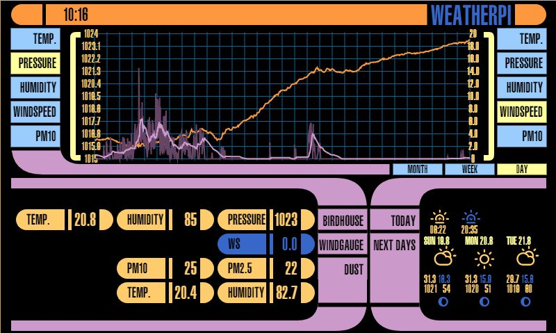

# WeatherPi

Java 8 program to display various sensors or components connected to a RaspberryPi on a [7-segment display](https://learn.adafruit.com/adafruit-led-backpack/1-2-inch-7-segment-backpack). For the communication with the display and the sensors, [Pi4J](http://pi4j.com/) is used. Additionally, there is a touch screen displaying data.

## Sensors
The list of actually implemented sensors.

*   BMP085: Temperature and Pressure
*   DHT22: Temperature and Humidity
*   LDR (VT43N2): Illuminance
*   TGS2600: Air quality

## Components
The list of actually implemented components.

*   Clock: Shows the actual time

## Database
The sensor data is written to a [MySQL](http://www.mysql.com/) database for later processing of the data.

## 7'' Touch Screen
The touch screen used is the 7'' display set from [Polin](http://www.pollin.de/shop/dt/NTMwOTc4OTk-/Bauelemente_Bauteile/Aktive_Bauelemente/Displays/7_17_78_cm_Display_Set_mit_Touchscreen_LS_7T_HDMI_DVI_VGA_CVBS.html). It is connected via the HDMI port to the RaspberryPi.

