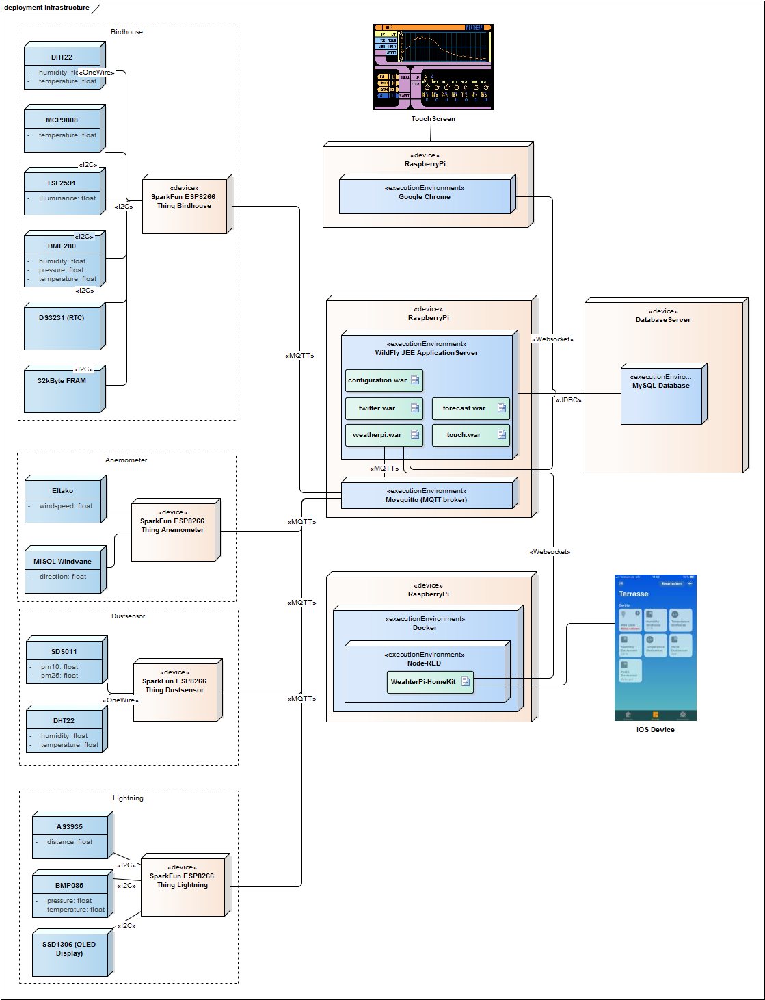

#  WeatherPi

WeatherPi is a JEE based project. The used application server is a [WildFly](http://wildfly.org/) running on a RaspberryPi. There are different components
delivering sensor data. The sensor data is collected, processed and stored into a database.

There is another RaspberryPi with a connected touch screen displaying the sensor data.

All outdoor sensors are connected to different ESP8266 WiFi modules.

Forecast data is retrieved from [ForecastIO](http://forecast.io) and actual data is pushed to twitter.

## Sensors
The list of actually implemented sensors.

### Birdhouse:
*   [TSL2591: Light Sensor](https://www.adafruit.com/product/1980)
*   [MCP9808: Temperature](https://www.adafruit.com/product/1782)
*   [DHT22: Temperature and Humidity](https://www.adafruit.com/product/393)
*   [BME280: Temperature, Humidity and Pressure](https://www.adafruit.com/product/2652)

### Anemometer
*   [Eltako : Windspeed](https://www.amazon.de/Eltako-Windsensor-WS/dp/B0018LBFG8)

## MQTT
The [Birdhouse](#birdhouse) and the [Anemometer](#anemometer) are publishing their sensor data via MQTT to a local installed
[Mosquitto broker](http://www.eclipse.org/mosquitto/). [Here](http://www.mymakerprojects.com/index.php/setup-mosquitto-mqtt-server-on-the-raspberry-pi/) are
some instructions for the installation of the Mosquitto MQTT Server on the RaspberryPi.
The published messages are JSON encoded, this makes it easy to convert them to Java or JavaScript objects.

```json
{
    "sensor": "DHT22",
    "place": "BIRDHOUSE",
    "type": "TEMPERATURE",
    "temperature": 4.7000,
    "time": 1502381794
}
```
The time parameter is optional, if no present, the actual time will be used.

## Database
The sensor data is written to a [MySQL](http://www.mysql.com/) database for later processing of the data.


## Data Display
One RaspberryPi with a connected 7'' touch screen is used to display the data. Therefore, Chrome is started in Kiosk mode.


The user interface is touch enabled and optimized for the sreen resolution of the original RaspberryPi touch screen.
Live data is published via WebSockets and forecast data is used from [ForecastIO](#forecastio). It is also possible to display
historical data for the temperature, humidity, pressure and the wind speed. There are three ranges, back one day, one week ore one month.
The display is updated continuously.

## Twitter
Actual weather data is pushed via the [Twitter REST API](https://dev.twitter.com/rest/public). This is done using the
[Twitter4J](http://twitter4j.org/en/index.html) library. Every three hours, the actual temperature, humidity and pressure is posted,
every hour the pressure tendency and the actual wind speed and once a day a [climatological classification of the last day](https://de.wikipedia.org/wiki/W%C3%BCstentag_%28Meteorologie%29).

## ForecastIO
Reading weather forecast from [ForecastIO](http://forecast.io) using their [API](https://developer.forecast.io/docs/v2). The data is queried each hour and cached internally. The icons used for displaying some weather informations are from [Adam Whitcroft](http://adamwhitcroft.com/climacons/)


## Deployment View
A description of the software and hardware components.



